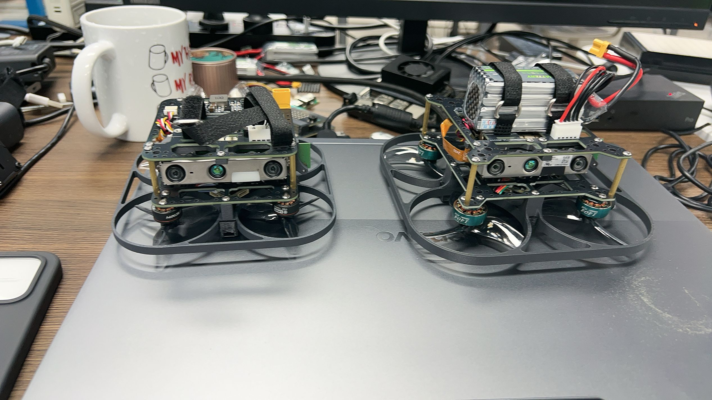
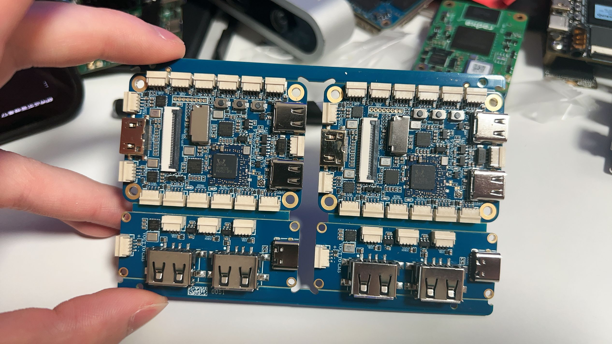
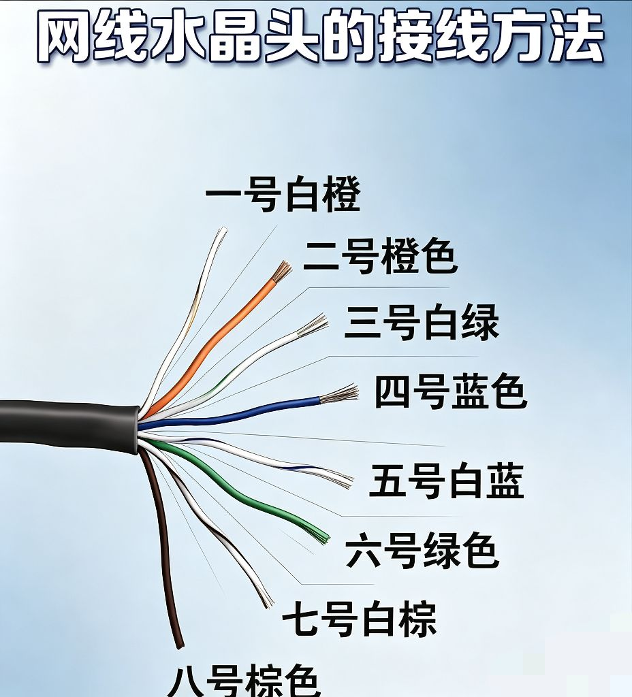
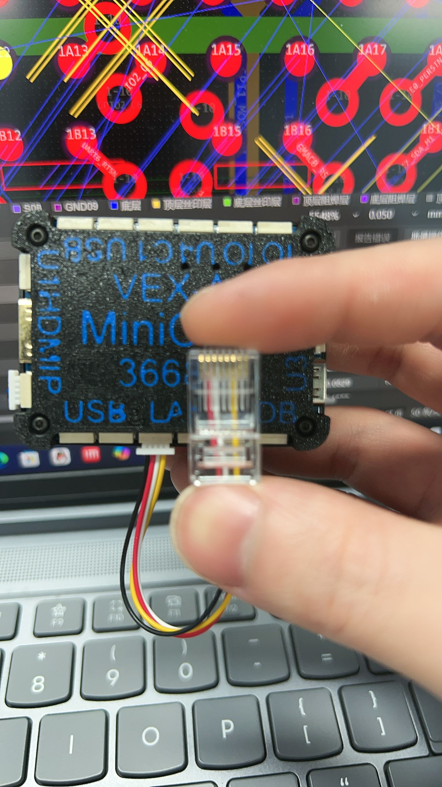







# 纭欢璇存槑
## OrangeCM5鑺墖妗嗗浘
鏈簳鏉夸笓涓篟K3588CM5鏍稿績鏉胯璁?- RK3588S2
- RK3588S1


## 瀹炵墿


## 鎺ュ彛鎬昏


- 1x USB3.0 (娉ㄦ剰 **浠呭柈闈?* Type-C)
- 1x 鍏ㄥ姛鑳?Type-C OTG
- 4x SH1.0-USB2.0
- 3x SH1.0-UART (鍙暥 GPIO*2)
- 1x SH1.0-PWM*2 (鍙暥 GPIO*2)
- 1x SH1.0-CAN1 (鍙暥 GPIO*2)
- 1x SH1.0-SPI0 (鍙暥 GPIO*2)
- 1x MIPI-CSI
- 1x MIPI-DSI
- 1x 8PIN 澶氬姛鑳芥帓姣?(GPIO4锛屽彲鐣跺叐绲?UART/IIC 鎴栦竴绲?SPI锛屽強涓€绲?USB2)
- 1x SH1.0 闆绘簮杓稿叆
- 1x 鐢ㄦ埗鑷畾缇╅枊闂?GPIO4_A6


## 鎺ュ彛璇︽儏

### 鐢垫簮鎺ュ彛

- **SH1.0 鐢垫簮杈撳叆**锛?V 杈撳叆锛屽甫闃插弽鎺ヤ簩鏋佺
- **Type-C OTG & PD 杈撳叆**锛氭敮鎸佺儳褰曠郴缁燂紝**寤鸿浣跨敤 5V/4A~6A 鐢垫簮閫傞厤鍣?*

**渚涚數璇存槑**锛?
- 涓婂浘涓孩鍦堢殑 SH1.0 鎺ュ彛锛堜粠涓婂埌涓嬩负 ++--锛夛紝杈撳叆鐢靛帇 5V锛屽甫闃插弽鎺ヤ簩鏋佺


- 绾㈠湀涓殑寮€鍏冲湪 **NO** 鐘舵€佹椂锛屽彲浣跨敤 Type-C OTG 渚涚數锛?*璇蜂粎鍦ㄧ儳褰曟椂浣跨敤**锛?
### PWM椋庢墖鎺ュ彛


PWM 鐢?5V,GPIO1_A7(PWM3-M3, GPIO1-C6(PWM15-M2,GND 绲勬垚

### 鏈夌嚎缃戝彛锛堢櫨鍏嗭級


鎻愪緵鐧惧厗浠ュお缃戞帴鍙ｃ€?

| Pin | Name      | Pin | Name      |
| --- | --------- | --- | --------- |
| 1   | ETH0_D+   | 2   | ETH0_D-   |
| 3   | ETH1_D+   | 4   | ETH1_D-   |

瀵瑰簲 RJ45 鐨?1銆?銆?銆? 寮曡剼銆?
鎺ョ嚎鍥撅細

### SH1.0-USB2.0 鎺ュ彛


| 寮曡剼 | 淇″彿 |
|------|------|
| 1 | 5V |
| 2 | D- |
| 3 | D+ |
| 4 | GND |

### SH1.0-UART 鎺ュ彛锛堝彲褰?GPIO脳2锛?
鎵€鏈?UART 鎺ュ彛寮曡剼鎺掑垪锛堜粠宸﹀埌鍙筹級锛歚5V` `(Rx)` `(Tx)` `GND`

| 鎺ュ彛 | Rx 寮曡剼 | Tx 寮曡剼 |
|------|---------|---------|
| UART1-M1 | GPIO1_B7 | GPIO1_B6 |
| UART2-M1 | GPIO4_D1 | GPIO4_D0 |
| UART4-M2 | GPIO1_B2 | GPIO1_B3 |
| UART6-M1 | GPIO1_A0 | GPIO1_A1 |

### SH1.0-PWM 鎺ュ彛锛堝彲褰?GPIO脳2锛?
寮曡剼鎺掑垪锛堜粠宸﹀埌鍙筹級锛歚5V` `PWM1` `PWM2` `GND`

| 鎺ュ彛 | 寮曡剼 | 鍔熻兘 |
|------|------|------|
| PWM3-M3 | GPIO1_A7 | PWM 杈撳嚭 |
| PWM15-M2 | GPIO1_C6 | PWM 杈撳嚭 |

### SH1.0-CAN 鎺ュ彛锛堝彲褰?GPIO脳2锛?
寮曡剼鎺掑垪锛堜粠宸﹀埌鍙筹級锛歚5V` `CAN_Rx` `CAN_Tx` `GND`

| 鎺ュ彛 | Rx 寮曡剼 | Tx 寮曡剼 |
|------|---------|---------|
| CAN1-M1 | GPIO4_B2 | GPIO4_B3 |

### SH1.0-SPI 鎺ュ彛锛堝彲褰?GPIO脳2锛?
**SPI0-M2 寮曡剼鍒嗛厤**锛?
| 淇″彿 | 寮曡剼锛堝乏鍥撅級 | 淇″彿 | 寮曡剼锛堝彸鍥撅級 |
|------|-------------|------|-------------|
| MOSI | GPIO1_B2 | CS0 | GPIO1_B4 |
| CLK  | GPIO1_B3 | MISO | GPIO1_B1 |
| 5V   | -          | GND  | -           |

### 8PIN 澶氬姛鑳芥帓姣?
鎵嬫嬁鎺掓瘝浠庡乏鍒板彸寮曡剼瀹氫箟锛?
| 寮曡剼 | 淇″彿 |
|------|------|
| 1 | GPIO1-D0 |
| 2 | GPIO1-D1 |
| 3 | GPIO1-D2 |
| 4 | GPIO1-D3 |
| 5 | USB_N |
| 6 | USB_P |
| 7 | GND |
| 8 | 5V |

#### 鍔熻兘澶嶇敤閰嶇疆

| 鍔熻兘 | 寮曡剼鏄犲皠 |
|------|----------|
| UART6-M2 | Rx=GPIO1-D1, Tx=GPIO1-D0 |
| IIC7-M0 | SDA=GPIO1-D1, SCL=GPIO1-D0 |
| UART4-M0 | Rx=GPIO1-D3, Tx=GPIO1-D2 |
| IIC1-M4 | SDA=GPIO1-D3, SCL=GPIO1-D2 |
| SPI1-M2 | MISO=GPIO1-D0, MOSI=GPIO1-D1, CLK=GPIO1-D2, CS0=GPIO1-D3 |

#### GPIO 鐢靛帇瑙勬牸

| GPIO 绫诲瀷 | 鐢靛帇 | 鏈€楂樿€愬帇 |
|-----------|------|----------|
| 鎵€鏈?GPIO | 3.3V | 3.63V |

### MICRO HDMI

閰嶅mICRO HDMI 鎺ュ彛

**鐗规€?*锛欻DMI 鎺ュ彛鎺ュ叆浜?EEPROM锛屽彲浠ヤ笉鎻掕楠楀櫒鍦?NoMachine 杩滅▼浣跨敤銆傞姗欐淳 CM5/5B 鐨勭郴缁熶笉闇€瑕佽楠楀櫒鍗冲彲杩滅▼銆?
### USB 鎺ュ彛


**鈿狅笍 娉ㄦ剰锛侊紒锛乁SB3.0鎺ュ彛涓哄崟闈紒锛佽瘑鍒笉鍒版垨鑰呮棤娉曟弧瓒宠姹傚彲浠ュ皾璇曟洿鎹㈠弽闈紒锛侊紒**


| 鎺ュ彛绫诲瀷 | 鏁伴噺 | 璇存槑 |
|----------|------|------|
| USB3.0 Type-C | 1 | 鍗曢潰 |
| 鍏ㄥ姛鑳?Type-C OTG | 1 | 鍙敤浜庣儳褰曠郴缁燂紙鎸変綇 BOOT 鍐嶄笂鐢碉級 |
| SH1.0-USB2.0 | 4 | 5V/D-/D+/GND |


### MIPI CSI


鏀寔 MIPI 鎽勫儚澶? 閲囩敤浜?31PIN 0.3mm 鑴氳窛 FH35C-31S-0.3SHW(50) 闀€閲戝骇瀛愩€?
鍙傝€僛1300涓囧儚绱犳憚鍍忓ご锛?3855锛塢(http://www.orangepi.cn/html/hardWare/computerAndMicrocontrollers/details/13-MP-Camera-13855.html)


鐩墠寮€鍙戞澘鏀寔涓ゆMIPI鎽勫儚澶达紝OV13850 鍜孫V13855
鍏蜂綋鐨勫浘鐗囧涓嬫墍绀猴細

a. 1300 涓嘙IPI鎺ュ彛鐨凮V13850 鎽勫儚澶?

b. 1300 涓嘙IPI鎺ュ彛鐨凮V13855 鎽勫儚澶淬€?
OV13850 鍜孫V13855 鎽勫儚澶翠娇鐢ㄧ殑杞帴鏉垮拰FPC鎺掔嚎鏄竴鏍风殑锛屽彧鏄袱娆炬憚鍍?澶存帴鍦ㄨ浆鎺ユ澘涓婄殑浣嶇疆涓嶄竴鏍枫€?FPC鎺掔嚎濡備笅鍥炬墍绀猴紝

璇锋敞鎰廎PC鎺掔嚎鏄湁鏂瑰悜鐨勶紝
鏍囨敞TO MB閭ｇ闇€瑕佹彃鍒板紑鍙戞澘鐨勬憚鍍忓ご鎺ュ彛涓紝鏍囨敞TO CAMERA閭ｇ闇€瑕佹彃鍒?鎽勫儚澶磋浆鎺ユ澘涓娿€?绯荤粺涓彧鏈?CAM1 鍙互鐢ㄦ潵鎺?OV13850 鎴?OV13855 鎽勫儚澶淬€?


### 鐢ㄦ埛鑷畾涔夊紑鍏?
- **GPIO4_A6**锛氱敤鎴疯嚜瀹氫箟鎸夐敭

---

### USB HUB 瀛愭澘璇存槑

#### 宸ヤ綔妯″紡

| 妯″紡 | 璇存槑 |
|------|------|
| **妯″紡涓€锛氱嫭绔?USB HUB** | Type-C 鎺ュ彛浣滀负 USB HUB 杈撳叆锛屽彲杩炴帴鐢佃剳浣跨敤锛屼篃鍙帴鍏?5V/4A 閫傞厤鍣ㄤ緵鐢?|
| **妯″紡浜岋細CM5 渚涚數鍣?* | Type-C 鎺ュ叆 5V/4A 閫傞厤鍣紝鍙充晶 SH1.0 鍙ｈ緭鍑虹數婧愮粰 CM5 渚涚數锛堟鏃?USB HUB 鍔熻兘涓嶅彲鐢級 |
| **妯″紡涓夛細CM5 USB HUB** | 灏?USBIN 鐨?SH1.0 鎺ュ叆 CM5 鐨?SH1.0 USB 鎺ュ彛锛屼綔涓?CM5 鐨?USB HUB 浣跨敤 |

#### USB HUB 鎺ュ彛鍒嗛厤

- 2 脳 USB-A
- 2 脳 SH1.0 USB锛堢數婧愯緭鍑轰负 3.3V锛?
> **鈿狅笍 娉ㄦ剰**锛氫緵鐢垫ā寮忓拰 USB HUB 妯″紡涓嶈兘鍚屾椂宸ヤ綔锛?
---

## 馃洅 鎺ㄨ崘閰嶄欢

### 1. 澶╃嚎
- 鍨嬪彿锛欶PC 25脳9mm锛孖PEX 4浠ｆ帴鍙?- 閾炬帴锛歔鐐瑰嚮鏌ョ湅](https://e.tb.cn/h.hokmrR7hdwkJPQp?tk=bnwb4TbYVtf)

### 2. 鏁ｇ儹鍣?
- **闇€瑕佹敼绾胯矾**锛氬皢鍘熺嚎搴忔敼涓猴細榛?鈫?榛?鈫?钃?鈫?绾?- 閾炬帴锛歔鐐瑰嚮鏌ョ湅](https://e.tb.cn/h.hr61t6j4rWMbQmj?tk=Tc7C4iwU7TM)

### 3. 鐢垫簮閫傞厤鍣?- 瑙勬牸锛?V/5A
- 閾炬帴锛歔鐐瑰嚮鏌ョ湅](https://e.tb.cn/h.hLXRHAoSP7hww9J?tk=DwtO4Tb3Y0S)

### 4. 5V DCDC 妯″潡
- 閾炬帴锛歔鐐瑰嚮鏌ョ湅](https://e.tb.cn/h.hoktLvvIXoDKxrg?tk=yvd44Tb5gnL)

### 5. FPC Type-C 绾?- 瑙勬牸锛?*鏃犺姱鐗?*鐗堟湰
- 閾炬帴锛歔鐐瑰嚮鏌ョ湅](https://e.tb.cn/h.hI1fzRUwbJa73Sp?tk=eQ164RPfhXx)

## 鈿狅笍 娉ㄦ剰浜嬮」

1. **渚涚數瑕佹眰**锛氬缓璁娇鐢?5V/5A 鎴栨洿楂樿鏍肩殑鐢垫簮
2. **闃插弽鎺?*锛歋H1.0 鐢垫簮杈撳叆宸插甫闃插弽鎺ヤ簩鏋佺锛屼絾 Type-C 杈撳叆鏃犱繚鎶?3. **USB HUB 妯″紡**锛氫緵鐢垫ā寮忓拰 USB HUB 妯″紡涓嶈兘鍚屾椂浣跨敤
4. **鏁ｇ儹鍣ㄦ敼瑁?*锛氳喘涔版暎鐑櫒鍚庤鎸夎鏄庢敼绾垮簭
5. **鐒婃帴鎿嶄綔**锛氬闇€淇敼 40-Pin USB 鍔熻兘閰嶇疆锛屽缓璁敱鏈夌粡楠岀殑鎶€鏈汉鍛樺畬鎴?
# 璧勬簮涓嬭浇姹囨€?

## 鎿嶄綔绯荤粺闀滃儚

### 鎻愪緵绠€鍗曢€傞厤鐨勬搷浣滅郴缁熼暅鍍?
**MiniCoreV2绯荤粺**
-    Ubuntu20.04
	瑁呭ソros1,realsense,vins ego(娌″仛璋冭瘯)
	```
	鐢ㄦ埗鍚?orangepi 瀵嗙⒓(灏忓L):l
	```
	https://pan.baidu.com/s/1dXIxiatij07BU-YQQDy7Aw?pwd=rgex

**loki鐨剈buntu20绯荤粺**
-    Ubuntu20.04(绾郴缁熸棤杞欢锛屽埛鏈烘垨鍏朵粬浣跨敤)
	
	
	鐢ㄦ埗鍚?orangepi 瀵嗙⒓(灏忓L):l
	
	https://pan.baidu.com/s/1_ds5qjKl700lFKau_oatoA?pwd=ngis

**璀﹀憡**
闄や簡涓婇潰鐨勯暅鍍忕粡杩囨祴璇曞彲浠ヤ娇鐢ㄥ锛屽叾浠栧巶瀹堕暅鍍忔湭缁忚繃娴嬭瘯锛屽彲鑳戒細瀛樺湪鏈煡闂锛屼粎鐢ㄤ簬璇勪及浣跨敤銆?
**澶囨敞**
鐩墠MiniCoreV2鎻愪緵鐨凩inux 闀滃儚浠呬负 ROS1鍙互浣跨敤鐨刄buntu20.04 鐗堟湰锛屽叾浠? 鐗堟湰鏆備笉鎻愪緵


## RK绯荤粺宸ュ叿
 - RK瀹樻柟鐨凟MMC鐕掗寗宸ュ叿
	 **RKDevTool_v3.15:**
	
	https://pan.baidu.com/s/15GJD84DV1e0mozEdzKbzkQ?pwd=j1d6


# 蹇€熶笂鎵?
## 1. 瀹夎绯荤粺鍒?EMMC鍗?
### 1. Type-C OTG 鐑у綍

鎸変綇 **BOOT / MaskROM** 鎸夐敭鍐嶄笂鐢碉紝鍗冲彲杩涘叆鐑у綍妯″紡杩涜绯荤粺鐑у綍銆?
### 2. 涓嬭級EMMC鐕掗寗宸ュ叿RKDevTool_v3.15

- 涓嬭浇瑙ｅ帇鍚庯紝閫夋嫨DriverAssitant_v5.12鏂囦欢澶圭殑Driverinstall鏂囦欢


- 鐐瑰嚮鍚姩锛岃窡闅忔寚寮曞畬鎴愬伐鍏蜂笅杞?


###  3. 绯荤粺鍥轰欢涓嬭浇
- 杩炴帴杩涘叆BOOT妯″紡鐨勪富鏈猴紝鍚姩绋嬪簭
- 

- 鐐瑰嚮娴忚閿紝閫夋嫨缃戠洏涓嬭浇濂界殑鍥轰欢


 
 - 閫夋嫨EMMC涓嬭浇


- 寮哄埗鍦板潃鍒峰啓


- **鏂數閲嶅惎鍚庡嵆鍙繘鍏ョ郴缁?*


## 2.OV13855鎽勫儚澶寸殑绠€鍗曟祴璇?
### 聽璁惧鏍戦厤缃?
- 鎵撳紑缁堢锛岃繍琛?*orangepi-config**鍛戒护锛屾櫘閫氱敤鎴疯寰楀姞**sudo**鏉冮檺
```
sudo orangepi-config
```

-  閫氳繃聽[璁惧鏍戦厤缃甝聽鏉ュ惎鐢燙M5 Camera1聽鐨?Overlay

	 閫夋嫨System

	閫夋嫨Hardware

	涓嬫粦閫夋嫨  **opicm5-tablet-cam1**


 ### 閲嶅惎绯荤粺

- 杩涘叆缁堢 渚濇娴嬭瘯涓ゆ潯鑴氭湰鍛戒护锛屼竴鏉″け璐ュ皾璇曞彟涓€鏉?
```
test_camera.sh
```
```
bash test_camera.sh
```


- 鎸変笅 **CTRL+C** 缁撴潫鍛戒护


## 3.鑷富瑙勫垝绠楁硶閮ㄧ讲

### 1-PUTTY杩炴帴


- 杈撳叆3588缃戝崱鐨刬p鍦板潃锛屾垨鑰呭煙鍚嶏紙璇ュ煙鍚嶈瑙ｆ瀽鍒版湇鍔″櫒锛?- 鎸囧畾绔彛锛岄粯璁ゆ槸 22绔彛銆?杩欎釜绔彛瑕佸拰鏈嶅姟鍣ㄤ笂鐨勯厤缃竴鑷达紝榛樿灏辨槸 22 绔彛)
- 閫夋嫨杩炴帴鐨勫崗璁€?SSH鎴栬€呬覆鍙?
- 鐐瑰嚮 open 銆?
### 2-鐧诲綍CM5


ubuntu20.04 绯荤粺
- 鐢ㄦ埗鍚?orangepi 
- 瀵嗙⒓(灏忓 L):l 
https://pan.baidu.com/s/1_ds5qjKl700lFKau_oatoA?pwd=ngis 


### 3-ROS瀹夎

	楸奸ROS涓€閿畨瑁呭懡浠わ細
- **wget http://fishros.com/install -O fishros && . fishros 

杈撳叆鍚庯細


	涓€閿畨瑁匯OS
- **** 杈撳叆锛?


	鏇存崲绯荤粺婧愬畨瑁?- **** 杈撳叆锛?


	浠呮洿鎹㈢郴缁熸簮
- **** 杈撳叆锛?


	閫夋嫨ROS婧?- **** 杈撳叆锛?


	閫夋嫨ROS1妗岄潰鐗?- **** 杈撳叆锛?/1


	 瀹夎鎴愬姛


### 4-MAVROS 涓?RealSense 椹卞姩瀹夎

#### 1. MAVROS 瀹夎涓庨厤缃?
`sudo apt install -y ros-noetic-mavros` 
浠?ROS 瀹樻柟浠撳簱瀹夎 MAVROS 鏍稿績鍖呫€俙-y` 琛ㄧず鑷姩纭锛屾棤闇€鎵嬪姩鐐瑰嚮 [Y]銆?
`cd /opt/ros/noetic/lib/mavros` 
杩涘叆绯荤粺 MAVROS 鐨勫簱鑴氭湰鐩綍銆?
`sudo ./install_geographiclib_datasets.sh` 
杩愯鍦扮悊鏁版嵁闆嗕笅杞借剼鏈€傝繖鏄?MAVROS 姝ｅ父杩愯锛堝挨鍏舵槸澶勭悊 GPS 鍜屽叏鐞冨潗鏍囷級鎵€蹇呴』鐨勬暟鎹敮鎾戙€?
`sudo sed -i '5c <arg name="fcu_url" default="/dev/ttyACM0:921600" />' /opt/ros/noetic/share/mavros/launch/px4.launch`
浣跨敤 `sed` 鍛戒护鐩存帴淇敼 MAVROS 鐨勫惎鍔ㄩ厤缃枃浠躲€傚皢绗?5 琛屾浛鎹负鎸囧畾鐨勪覆鍙ｈ澶囷紙`/dev/ttyACM0`锛夊拰娉㈢壒鐜囷紙`921600`锛夛紝杩欐槸杩炴帴 PX4 椋炴帶鐨勭‖浠堕€氳矾銆?
---

#### 2. RealSense 椹卞姩锛圠ibRealSense锛夊畨瑁?
`cd ~` 杩斿洖鐢ㄦ埛瀹剁洰褰曘€?
`wget https://github.com/IntelRealSense/librealsense/raw/master/scripts/libuvc_installation.sh` 
浠?GitHub 涓嬭浇 Intel 瀹樻柟鎻愪緵鐨勫熀浜?`libuvc` 鐨勫畨瑁呰剼鏈紝杩欑鏂瑰紡鍦?Arm 寮€鍙戞澘涓婇€氬父鏇寸ǔ瀹氥€?
`chmod +x ./libuvc_installation.sh`
缁欎笅杞界殑鑴氭湰璧嬩簣鈥滃彲鎵ц鈥濇潈闄愶紝浣垮叾鍙互浣滀负绋嬪簭杩愯銆?
`sed -i '12c ##'` libuvc_installation.sh`浣跨敤`sed` 淇敼鑴氭湰绗?12 琛屻€?閫氬父鏄负浜嗗睆钄芥帀鑴氭湰涓煇浜涗笉鍏煎鐨勭郴缁熸鏌ユ垨鐗瑰畾鐨勭幆澧冨彉閲忚缃€?
`sed -i '47c make -j8' libuvc_installation.sh` 
淇敼鑴氭湰绗?47 琛岋紝灏嗙紪璇戝懡浠ゆ敼涓哄绾跨▼缂栬瘧锛坄make -j8`锛夛紝浠ュ厖鍒嗗埄鐢?Orange Pi CM5 鐨?8 鏍?CPU 鎬ц兘锛屽姞蹇畨瑁呴€熷害銆?
`./libuvc_installation.sh` 
姝ｅ紡鎵ц淇敼鍚庣殑瀹夎鑴氭湰锛屽紑濮嬩笅杞姐€佺紪璇戝苟瀹夎 RealSense 鐨勫簳灞傞┍鍔ㄥ簱銆?
锛侊紒锛佹祴璇曠敤锛?`#realsense-viewer` 
杩欐槸娉ㄩ噴鎺夌殑鍛戒护锛岀敤浜庡湪瀹夎瀹屾垚鍚庨€氳繃鍥惧舰鐣岄潰妫€鏌ユ憚鍍忓ご鏄惁姝ｅ父宸ヤ綔銆?

### 5-vins ego 閮ㄧ讲


娣诲姞鐢ㄦ埛鍒?dialout 缁勶紙涓插彛鏉冮檺锛?
```
sudo usermod -a -G dialout $USER 
```
 
#### 1. 浠ｇ爜鑾峰彇涓庡垵濮嬪寲


```
`git clone https://github.com/ZJU-FAST-Lab/Fast-Drone-250` 
```
浠?GitHub 杩滅▼浠撳簱鍏嬮殕 Fast-Drone-250 椤圭洰鐨勬簮浠ｇ爜鍒版湰鍦般€?

`cd Fast-Drone-250` 
杩涘叆鍏嬮殕濂界殑椤圭洰鏍圭洰褰曘€?

`unzip 3rd_party.zip` 
瑙ｅ帇椤圭洰鍐呯疆鐨勭涓夋柟搴撳帇缂╁寘锛堥€氬父鍖呭惈 glog銆丆eres 绛変緷璧栨簮鐮侊級銆?

`sudo chmod 777 -R ~/Fast-Drone-250` 
閫掑綊鍦扮粰椤圭洰鏂囦欢澶硅祴浜堟渶楂樿鍐欐墽琛屾潈闄愶紝闃叉缂栬瘧鎴栬繍琛屾椂鍥犳潈闄愪笉瓒虫姤閿欍€?
---

#### 2. 缂栬瘧瀹夎 glog (Google 鏃ュ織搴?

`cd glog` 
杩涘叆瑙ｅ帇鍑虹殑 glog 婧愮爜鐩綍銆?
`./autogen.sh && ./configure && make && sudo make install` 
椤哄簭鎵ц锛氱敓鎴愰厤缃剼鏈€佹鏌ョ幆澧冪敓鎴?Makefile銆佺紪璇戜唬鐮併€佹渶鍚庡畨瑁呭埌绯荤粺鐩綍銆?
---

#### 3. 瀹夎绯荤粺绾ф暟瀛︿笌 ROS 渚濊禆

`sudo apt install -y liblapack-dev libsuitesparse-dev libcxsparse3 libgflags-dev libgoogle-glog-dev libgtest-dev` 
浣跨敤 apt 鎵归噺瀹夎绾挎€т唬鏁拌繍绠楋紙LAPACK锛夈€佺█鐤忕煩闃佃繍绠椾互鍙?gflags 绛夋牳蹇冩暟瀛﹀紑鍙戝簱銆?

`sudo apt-get install ros-noetic-ddynamic-reconfigure` 
瀹夎 ROS Noetic 鐗堟湰鐨勫姩鎬佸弬鏁伴厤缃彃浠讹紝鐢ㄤ簬鍦ㄤ笉閲嶅惎鑺傜偣鐨勬儏鍐典笅璋冩暣鍙傛暟銆?
---

#### 4. 缂栬瘧瀹夎 Ceres Solver (闈炵嚎鎬т紭鍖栧簱)


`cd ../ceres-solver-2.0.0rc1` 
杩斿洖涓婄骇骞惰繘鍏?Ceres 浼樺寲搴撶殑婧愮爜鐩綍銆?
`mkdir build` 
鍒涘缓缂栬瘧涓撶敤鐨?build 鏂囦欢澶癸紝淇濇寔婧愮爜鐩綍鏁存磥銆?
`cd build`
杩涘叆缂栬瘧鏂囦欢澶广€?
`cmake ..` 
璋冪敤 CMake 鏍规嵁鐖剁洰褰曠殑閰嶇疆鐢熸垚褰撳墠骞冲彴鐨?Makefile 缂栬瘧鏂囦欢銆?
`sudo make -j8` 
璋冪敤 8 涓嚎绋嬪苟琛岀紪璇戯紙RK3588 寤鸿浣跨敤姝ゅ€嶆暟锛夛紝鏋佸ぇ缂╃煭缂栬瘧鏃堕棿銆?
`sudo make install` 
灏嗙紪璇戠敓鎴愮殑搴撴枃浠跺畨瑁呭埌绯荤粺涓紝渚涘悗缁棤浜烘満绠楁硶璋冪敤銆?
---

#### 5. ROS 宸ヤ綔绌洪棿缂栬瘧涓庣幆澧冮厤缃?


`cd ../..` 
杩斿洖鍒?Fast-Drone-250 鐨勯」鐩牴鐩綍銆?
`catkin_make` 
璋冪敤 ROS 鏍囧噯缂栬瘧宸ュ叿锛岀紪璇戞暣涓?`src` 鐩綍涓嬬殑鎵€鏈夊姛鑳藉寘锛堝 VINS銆丒GO-Planner锛夈€?
`echo "source ~/Fast-Drone-250/devel/setup.bash" >> ~/.bashrc` 
灏嗗綋鍓嶅伐浣滅┖闂寸殑鐜鍙橀噺璺緞姘镐箙娣诲姞鍒扮敤鎴烽厤缃枃浠剁殑鏈熬銆?
`source ~/.bashrc` 
绔嬪嵆鍒锋柊褰撳墠缁堢鐨勭幆澧冨彉閲忥紝浣垮垰鎵嶆坊鍔犵殑璺緞鐢熸晥銆?
---


#### 6. 鏁版嵁瀛樺偍鍑嗗

`mkdir vins_output` 
鍒涘缓鐢ㄤ簬瀛樻斁 VINS 绠楁硶瀹炴椂杈撳嚭缁撴灉鐨勬枃浠跺す銆?
`mkdir -p savedfiles/output/pose_graph` 
閫掑綊鍒涘缓浣嶅Э鍥撅紙Pose Graph锛夌殑淇濆瓨璺緞锛岀敤浜庡悗缁殑鍦板浘鍥炴斁鎴栦紭鍖栥€?
---

#### 7. 纭欢璁块棶鏉冮檺涓庡惎鍔ㄨ剼鏈?
馃憠 鍙互鐩存帴澶嶅埗鎵ц
```bash

cd ~  
source ~/Fast-Drone-250/devel/setup.bash  
  
# 1锔忊儯 RealSense锛堝繀椤诲紑 IMU锛屽惁鍒?VINS 浼氬崱锛? 
roslaunch realsense2_camera rs_camera.launch \  
enable_gyro:=true enable_accel:=true unite_imu_method:=linear_interpolation \  
> /tmp/realsense.log 2>&1 & sleep 5  
  
# 2锔忊儯 MAVROS锛堣繛鎺?PX4锛? 
roslaunch mavros px4.launch \  
> /tmp/mavros.log 2>&1 & sleep 5  
  
# 3锔忊儯 VINS锛堣瑙夐噷绋嬭锛? 
roslaunch vins fast_drone_250.launch \  
> /tmp/vins.log 2>&1 & sleep 5  
  
# 4锔忊儯 EGO Planner锛堣建杩硅鍒掞級  
roslaunch ego_planner single_run_in_exp.launch \  
> /tmp/ego.log 2>&1 & sleep 3  
  
# 5锔忊儯 MAVROS 鎸囦护锛堣皟棰戯級  
rosrun mavros mavcmd long 511 105 5000 0 0 0 0 0  
rosrun mavros mavcmd long 511 31 5000 0 0 0 0 0  
  
# 6锔忊儯 RViz锛堝墠鍙拌繍琛岋級  
roslaunch ego_planner rviz.launch

```
---

`sudo usermod -a -G dialout $USER` 
灏嗗綋鍓嶇敤鎴峰姞鍏?`dialout` 鐢ㄦ埛缁勶紝浠庤€岃幏寰楃洿鎺ヨ鍐欎覆鍙ｏ紙杩炴帴 PX4 椋炴帶锛夌殑鏉冮檺銆?
`roslaunch realsense2_camera rs_camera.launch & sleep 5;` 
鍚庡彴鍚姩 Intel RealSense 鎽勫儚澶撮┍鍔紝骞剁瓑寰?5 绉掔‘璁ょ‖浠跺惎鍔ㄦ垚鍔熴€?
`roslaunch mavros px4.launch & sleep 5;` 
鍚庡彴鍚姩 MAVROS 鑺傜偣锛堝缓绔嬩笌 PX4 椋炴帶鐨勯€氫俊锛夛紝骞剁瓑寰?5 绉掋€?
`roslaunch vins fast_drone_250.launch & sleep 3;
鍚庡彴鍚姩 VINS 瑙嗚閲岀▼璁★紝杩涜鐘舵€佷及璁★紝绛夊緟 3 绉掋€?
`roslaunch ego_planner single_run_in_exp.launch & sleep 2;`
鍚庡彴鍚姩 EGO-Planner 杞ㄨ抗瑙勫垝绠楁硶锛岀瓑寰?2 绉掋€?
`rosrun mavros mavcmd long 511 105 5000 0 0 0 0 0` 
閫氳繃 MAVROS 鍙戦€侀暱鍛戒护锛岃皟鏁撮鎺х殑娑堟伅棰戠巼锛堣繖閲岄€氬父鏄姹傞珮棰戠殑閲岀▼璁″弽棣堬級銆?
`rosrun mavros mavcmd long 511 31 5000 0 0 0 0 0`
鍚屼笂锛岃姹傞鎺у彂閫佺壒瀹氱殑濮挎€佹垨鐘舵€佹暟鎹€?
`roslaunch ego_planner rviz.launch` 
鍚姩 RVIZ 鍙鍖栫晫闈紝瑙傚療鏃犱汉鏈虹殑椋炶璺緞銆佸湴鍥惧強鐘舵€併€?
`wait;` 
绛夊緟鎵€鏈夊悗鍙拌繍琛岀殑杩涚▼缁撴潫锛堥槻姝富鑴氭湰閫€鍑哄鑷存墍鏈夊悗鍙拌妭鐐瑰叧闂級銆?
---

#### 8. 鑷姩鍖栧弬鏁颁慨鏀?(鏂囦欢閰嶇疆)

`sudo sed -i '16c output_path: "~/Fast-Drone-250/vins_output"' ~/Fast-Drone-250/src/realflight_modules/VINSFusion/config/fast_drone_250.yaml`
浣跨敤 sed 鍛戒护鐩存帴淇敼閰嶇疆鏂囦欢绗?16 琛岋紝鎸囧畾 VINS 鐨勮緭鍑鸿矾寰勩€?
`sudo sed -i '78c pose_graph_save_path: "~/Fast-Drone250/savedfiles/output/pose_graph/"' ~/Fast-Drone250/src/realflight_modules/VINS-Fusion/config/fast_drone_250.yaml` 
淇敼閰嶇疆鏂囦欢绗?78 琛岋紝鎸囧畾浣嶅Э鍥炬暟鎹殑淇濆瓨璺緞銆? 
浠跨湡璋冪敤 
`roslaunch ego_planner single_run_in_sim.launch 


